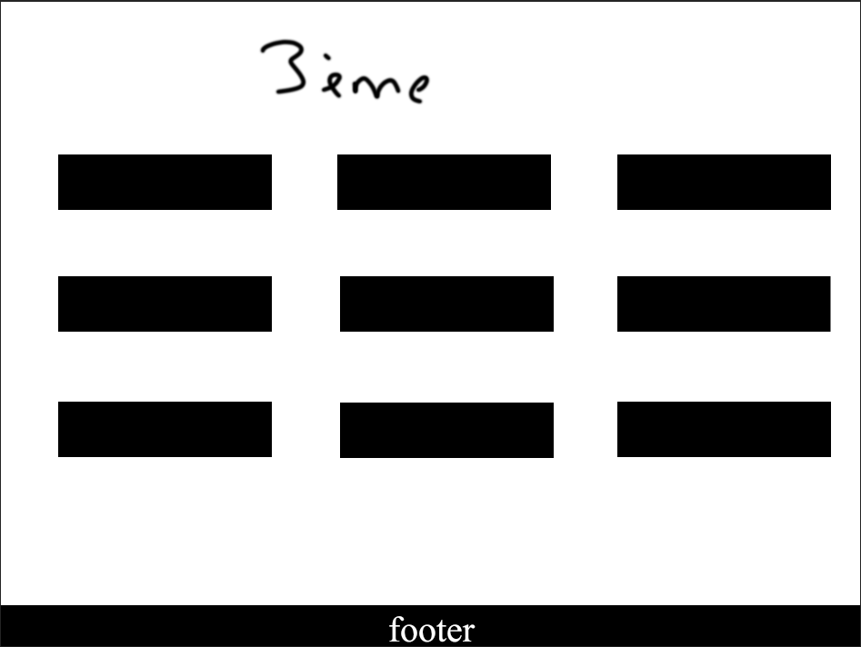

# School redirection buttons

  

Here is a system of buttons code by [Aeroget](https://github.com/aeroget) and [Valdouz](https://github.com/valdouz).

#How to use

You just need to download the files of the project. In your computer open `src/main.html` and in the href you can change every links.

Here it is the prototype of the project : 

